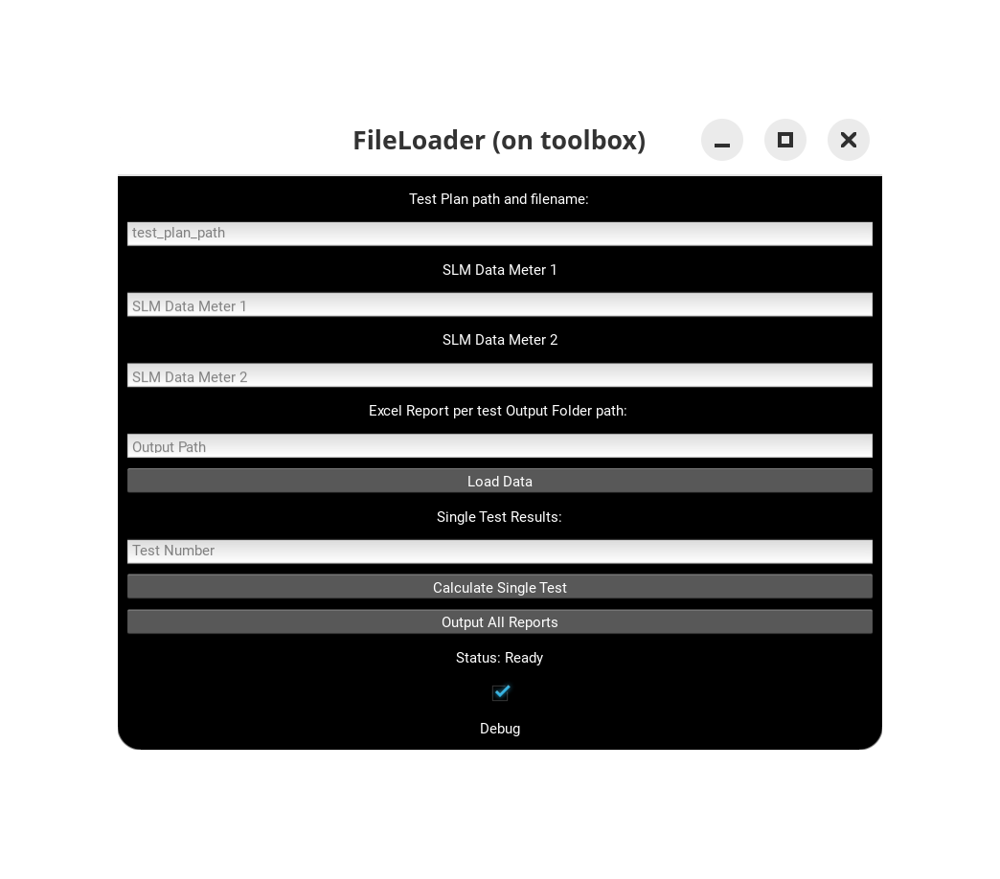

# STC Tester Reporter

## How to get started

Run the GUI (to get file locations)

`pip install pandas numpy openpyxl matplotlib reportlab kivy PyMuPDF`

`python run.py`

This is in 'Minimum Lovable Prototype' Phase of development, so please be gentle!

Input the appropriate file and folder paths, then press 'Load data'. This will copy the raw excel data into the appropriate dataframes for each test listed in the Testplan. 

Once the data is loaded, Use the 'Output All Reports' Button to calculate and generate the reports per the items in the Testplan excel document.

/Exampledata contains the properly stored Rawdata as well as the Testplanv2 formatted document, please review these and maintain the directory format to ensure no errors result.

The TestPlan format is critical to properly propigating the test information into the calculations and report generation. 
Errors and unexpected behaviors will result if the Testplanv2 format is not followed.

The 'Test Input Populate' button will utilize the /Exampledata folder's data for a test report output. 
