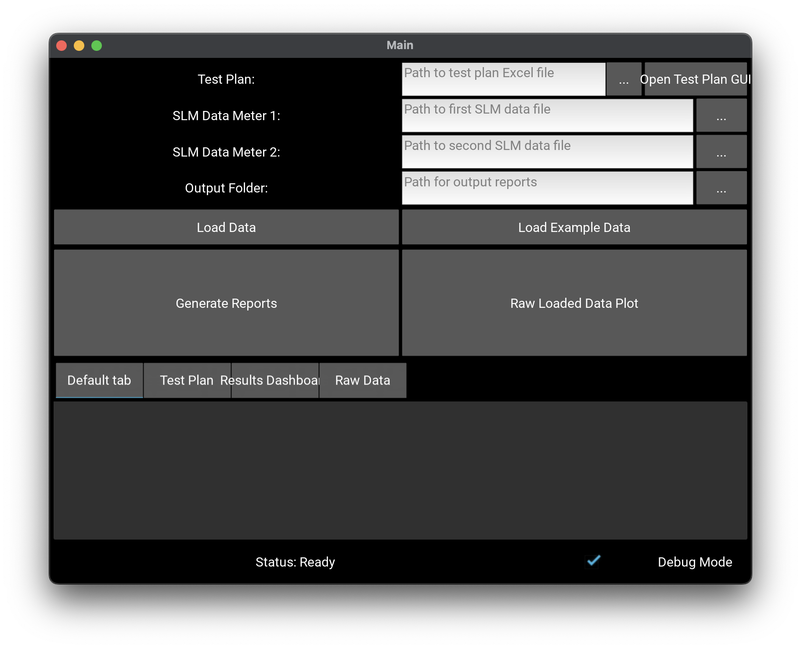

# ASTM Test Calculator

## How to get started

Run the GUI (to get file locations)

`pip install pandas numpy openpyxl matplotlib reportlab kivy PyMuPDF`

`python run.py`

This is in 'Minimum Lovable Prototype' Phase of development, so please be gentle!

Input the appropriate file and folder paths or use the ... button to search your install folder for the correct paths, then press 'Load data'. This will copy the raw excel data into the appropriate dataframes for each test listed in the Testplan. 

Once the data is loaded, a 'Plot Test Data' menu will show the tests available to plot: 

Checking the box by the appropriate test number and type and pressing 'Plot selected' will open the plot of the raw data and the test result calculations:

Once finished reviewing the dataplots, select 'Store Calculated Data' to store the results for input to the final CSV datafiles. This will also make the raw calculation results available in the Results Dasboard of the main menu. 

Use the 'Generate Reports' Button to generate the CSV reports from the stored data.

Use the 'Raw Loaded Data Plot' Button to return to the available loaded tests to select and store more data from the testplan.

/Exampledata contains the properly stored Rawdata as well as the Example_testplan.csv formatted document, please review these and maintain the directory format to ensure no errors result.

The TestPlan format is critical to properly propigating the test information into the calculations and report generation. 
Errors and unexpected behaviors will result if the Testplan format is not followed.

The 'Test Input Populate' button will utilize the /Exampledata folder's data for a test report output. 
